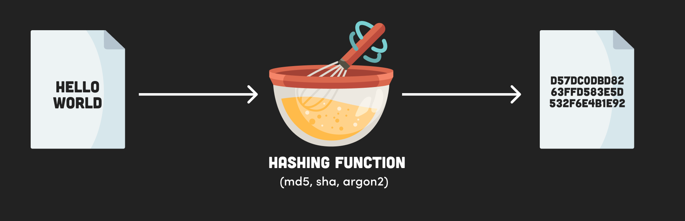
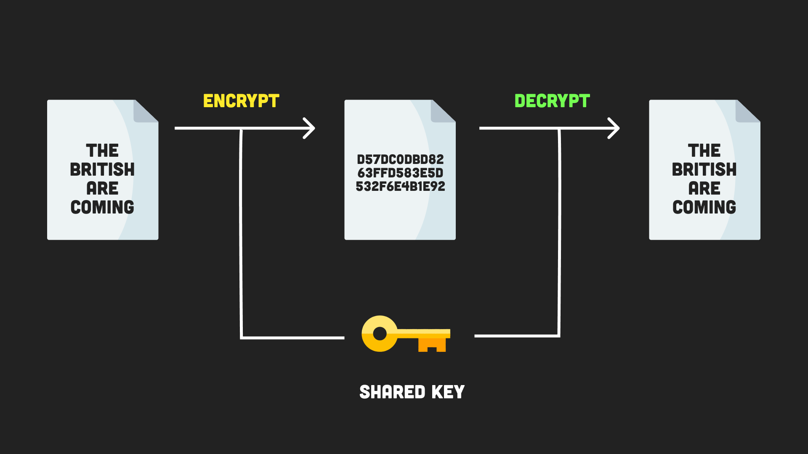

# Seven Key Cryptography Concepts

## 0. Source
[Video: Seven Cryptography Concepts Every Developer Should Know](https://fireship.io/lessons/node-crypto-examples/)

## 1. Hash
`Hash` means to *chop and mix*, which perfectly describes what a hashing function does.
It takes an input value of **any length** and outputs a **fixed length** value.
Hashing algorithms, like SHA (Secure Hashing Algorithm), produce a random, unique, fixed-length string from a given input.
They are often used to compare two values, like passwords, for equality.
- The same input will always produce the same output.
- Fast to compute, but computationally expensive to find the original input.
- Small probability of collision (unique).

## 2. Salt
Hashes are great for making passwords unreadable, but because they always produce the same output, they are not very secure.
A salt is a random string that is added to the input before hashing.
This makes the hash more unique and harder to guess.

Users often to use weak passwords, like “password123”.
When a database is compromised, the attacker can easily find the value of an unsalted hash by searching precomputed rainbow table of common hashes - salting fixes this.
- Used to make a hash harder to guess
- Appends a random string to the input before hashing

## 3. HMAC
HMAC (Hash-based Message Authentication Code) is a keyed hash of data - like a hash with a password.
To create a HMAC you need to have the key, therefore allowing you to verify both the authenticity and originator of the data.
Using a different key produces a different output.

- Think of HMAC as a hash with a password or key
- Only someone with the key can create an authentic hash

## 4. Symmetric Encryption
Encryption is the process of making a message confidential (like a hash), while allowing it to be reversible (decrypted) with the proper key.
Each time a message is encrypted it is randomized to produce a different output.
In symmetric encryption, the same key is used to encrypt and decrypt the message.

- The same input will produce a different output, unlike hashes
- Encrypted message can be reversed with the key
- Same key used to encrypt and decrypt message

## 5. Keypairs
Using a shared key works for encryption works, but the problem is that both parties must agree upon the key. 
This is problematic in the real world because it’s not practical or secure to share across a network.
The solution is to use an algorithm like [RSA](https://en.wikipedia.org/wiki/RSA_(cryptosystem)) that generates a keypair containing a public and private key. As their names indicate, the private key should be kept secret, while the public key can be shared freely.

## 6. Asymmetric Encryption
Asymmetric encryption depends on two keys:
- encrypt a message with the **public** key,
- and decrypt it with the **private** key.

Asymmetric encryption is used on the web whenever you use HTTPS to establish an encrypted connection to that website.
The browser finds the public key of an SSL certificate installed on the website, which is used to encrypt any data you send, then the private key decrypts it.

## 7. Digit Signing
Signing is the process of creating a digital signature of a message.
A signature is a hash of the original message which is then encrypted with the sender’s private key.

The signature can be verified by the recipient using the public key of the sender.
This can guarantee the original message is authentic and unmodified.

